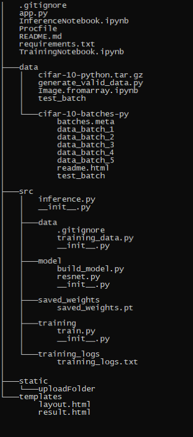
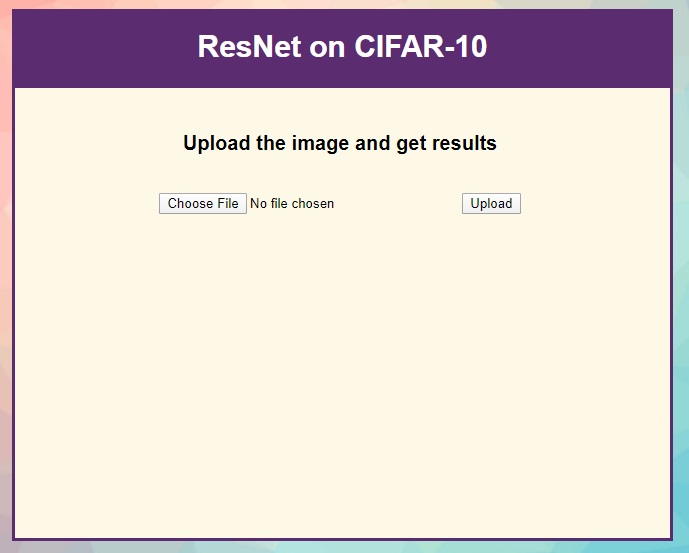

## Deployement of ResNet Architecture
[](http://hits.dwyl.com/veeravignesh1/DL-ResNet-Deploy)


### Team

- [Kunal Bharadwaj](https://github.com/kunalb510) - D19016
- [Pooja More](https://github.com/PoojaMore282) - D19021
- [Veera Vignesh](https://github.com/veeravignesh1) - D19036
- [Vighnesh Tamse](https://github.com/vighneshutamse) -D19037
- [DurjayDas](https://github.com/Durjaydas) - D19038

### Introduction

In the [DL-ResNet](https://github.com/veeravignesh1/DL-ResNet) Repo we have developed the ResNet architecture and experimented with various Hyper Parameters to push the accuracy of the base ResNet Model (ResNet-18) where we achieved an accuracy of 91.07%. 

In this Repo we extend it further using the weights generated by the model to develop a front end for testing the model. We have developed a Flask based web-app and deployed it on Heroku hosted at [deploy-resnet](https://deploy-resnet.herokuapp.com/). For further reference this repo can be cloned or downloaded from the [link](https://github.com/veeravignesh1/DL-ResNet-Deploy.git).

### Folder Structure



## Understanding the Folder Structure

We took the code of training and testing in a single file and created modular components of each of them and placed them in folders. Then [Training notebook](TrainingNotebook.ipynb) was created as an abstraction to run the model and to save `training_logs.txt` and `saved_weights.pt` which are then used during inference.

Using the weights generated during training a image is then passed to the model to make the inference of the class to which the image belongs to, Which is done in [Inference Notebook](InferenceNotebook.ipynb).

In order to develop the front end for the model we just need the saved weights and test image from CIFAR-10 dataset. A random 10 images can be generated by running [python file](data/generate_valid_data.py). Now we have all the requirements for building a flask app.

## Flask App

We created an  `app.py` file in the root directory of the folder structure which has a form to take one image from the user and on upload redirects to `result` displaying the image and the class that the image belongs to.

On click of upload the inference part of the image is carried out and the returned result is then stored and passed on during rendering.

This was then tested on `localhost` and then pushed to Github




## Deployment

We chose [Heroku](https://www.heroku.com/) for deployement. Preparing the Repo for Heroku Deployment.

- Heroku looks for 2 things

  - `Procfile` - Intital file to run during deployment

    ```python
    #Creates Procfile without any extensions
    touch Procfile
    #Open in notepad and write the following
    web: gunicorn app:app
    ```

    

  - `requirements.txt` - To install dependencies

    ```python
    flask==1.1.1
    gunicorn==20.0.4
    torch==1.4.0+cpu 
    torchvision==0.5.0+cpu 
    -f https://download.pytorch.org/whl/torch_stable.html
    Pillow==7.0.0
    numpy==1.15.4
    pandas==1.0.1
    matplotlib==3.1.3
    scikit-learn==0.22.2.post1
    Jinja2==2.11.1
    tqdm==4.42.1
    ```

 **Following are the steps followed to deploy the model on to heroku**

1. Sign up for a free account at [Heroku](https://www.heroku.com/)
2. Create a New app
3. Name the app (Will be part of the deployed URL)
4. Click Create app
5. Connect to Github
6. Choose the Repo that we need to deploy
7. Choose the Branch from which to deploy
8. Click on Deploy Branch
9. Turn on Automatic Deployment if needed

Heroku in the background runs all the dependencies and installs them. For free version of heroku hosting the bundle size is limited to 500MB. Once everything goes well our model will be deployed and we can view our link beloy it.

**Check Out our Deployment : [ResNet on CIFAR-10](https://deploy-resnet.herokuapp.com/)**

